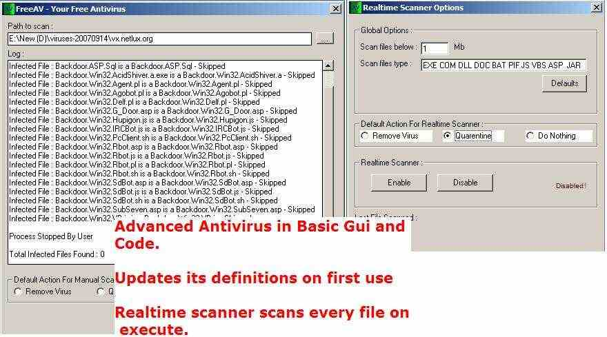



## FreeAntivirus \- Scans over 66000 viruses \+ Realtime scan \(updated Database Url\)

### Description

<b>AUG/2012 : Av.mdb is uploaded to http://ajaybnl.comuf.com/av.mdb</b> 

FreeAv - Antivirus purely written in vb including realtime scanner and more that 66000 virus definitions file (updated on first use automatically). Removes and also Quarentines virus based on settings. Added a Manual file scanner also. Sound alert on first virus found. First on PSC

All Errors Fixed till 11/2009

Please download some virus files from http://vx.netlux.org/ and test this antivirus.
 
### More Info
 

             |
---                |---
**Submitted On**   |2011-03-07 15:24:22
**By**             |[ajaybnl](https://github.com/Planet-Source-Code/PSCIndex/blob/master/ByAuthor/ajaybnl.md)
**Level**          |Advanced
**User Rating**    |4.9 (69 globes from 14 users)
**Compatibility**  |VB 6\.0
**Category**       |[Complete Applications](https://github.com/Planet-Source-Code/PSCIndex/blob/master/ByCategory/complete-applications__1-27.md)
**World**          |[Visual Basic](https://github.com/Planet-Source-Code/PSCIndex/blob/master/ByWorld/visual-basic.md)
**Archive File**   |[FreeAntivi219929372011\.zip](https://github.com/Planet-Source-Code/ajaybnl-freeantivirus-scans-over-66000-viruses-realtime-scan-updated-database-url__1-72084/archive/master.zip)

